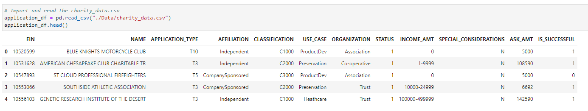
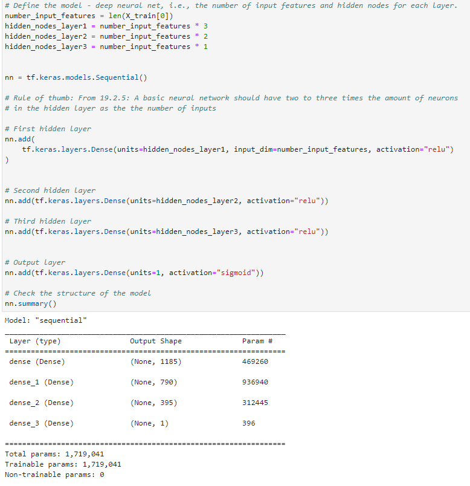
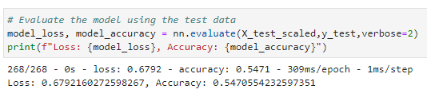

# Neural_Network_Charity_Analysis

## Overview of the analysis:

Create a binary classifier that is capable of predicting whether applicants will be successful if 
funded by Alphabet Soup.

## Data used in the analysis:

- EIN and NAME—Identification columns
- APPLICATION_TYPE—Alphabet Soup application type
- AFFILIATION—Affiliated sector of industry
- CLASSIFICATION—Government organization classification
- USE_CASE—Use case for funding
- ORGANIZATION—Organization type
- STATUS—Active status
- INCOME_AMT—Income classification
- SPECIAL_CONSIDERATIONS—Special consideration for application
- ASK_AMT—Funding amount requested
- IS_SUCCESSFUL—Was the money used effectively

## Sofware

- Python 
- Conda
- Jupyter Lab

## Results

- ### Data Processing

    - The column IS_SUCCESSFUL is considered the target for the deep learning neural network. It contains binary data that reveals if the money was used effectively.

    - The columns below are the features of this model. They have been encoded, split in to      training and test datasets, and standardization has been applied. 

        - APPLICATION_TYPE
        - AFFILIATION
        - CLASSIFICATION
        - USE_CASE
        - ORGANIZATION
        - STATUS
        - INCOME_AMT
        - SPECIAL_CONSIDERATIONS
        - ASK_AMT

    - The columns EIN and NAME have been removed from the input data becasue they are identifiers.

- ### Compiling, Training, and Evaluating the Model

     - The largest of the three models is composed of three layers consisting of  1,185, 790, and 395 neurons. The input data has 395 features and  1,719,041 parameters. The other two models were each smaller in scale.

     - None of the three models were able to achieve the target model performance of 75% for various reasons.

     - In an effort to improve the performance of the three models the number of layers, neurons, and features were increased as the progression from the first model to the third model took place. For the third model, the activation function *Relu* was used for the three hidden layers and *Sigmoid* was used for the output layer. This did not increase performance significantly.

## Summary

Being that the target performance was 75% and the best achieved result was 55% using the first model, we can say the models under achieved by a fair margin. To achieve better results, we could use the Random Forest Classifier which is a form of supervised machine learning. It builds a multitude of decision trees and generates an output based on the correlation of those decision trees. This may be a better algorithm to use considering the datasets we were given.

